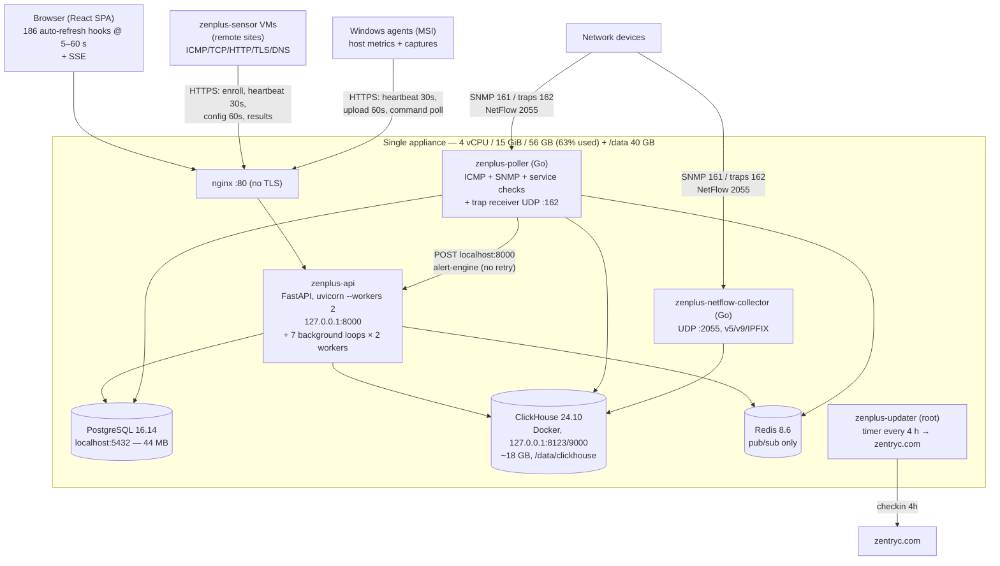
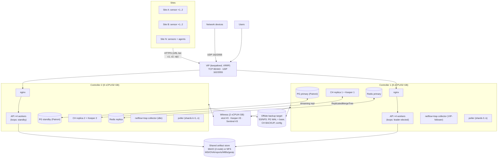

# ZenPlus — Enterprise HA & Scalability Architecture Assessment and Plan

**Version assessed:** 1.3.0 (branch `feat/apm-phase1`) · **Date:** 2026-08-04
**Method:** full code review of `server/`, `poller/`, `sensor-appliance/`, `updater/`, `install.sh`, all 51+ migrations, live inspection of the production appliance (10.12.50.81).

---

## 1. Executive summary

ZenPlus today is a **well-featured single-box appliance**: one host runs nginx, the FastAPI controller (2 uvicorn workers), the Go poller (ICMP + SNMP + service checks + trap receiver), the Go NetFlow collector, PostgreSQL 16, ClickHouse 24.10 (single Docker container), and Redis. Remote monitoring exists in the form of `zenplus-sensor` probe VMs that already run ICMP/TCP/HTTP/TLS/DNS checks from remote sites over outbound HTTPS.

The feature breadth is genuinely strong (SNMP, NetFlow, NCM, APM, discovery, agents, sensors, captures, reports). What is missing for enterprise-grade operation is **structural**, not functional:

1. **Availability** — every component is a singleton and the box itself is a single point of failure. Every OTA update takes the whole stack down for ~84 s. A dead controller is silent: there is no watchdog, no dead-man's switch, and the API permanently stops restarting after 5 crashes in 60 s.
2. **Data safety** — ClickHouse (all metric history) has **zero backups anywhere**, and it uses non-replicated engines on all 36 tables, so there is no HA path without a schema conversion. The Postgres backup cron is not shipped by the installer and is broken on this box (last backup 2026-04-15).
3. **Correctness under concurrency** — 7 of 9 background loops double-fire with >1 worker today (duplicate report emails, duplicate alerts); alert dedup has no DB constraint; notifications have no queue/retry, and alerts raised while the API restarts are lost.
4. **Scale ceilings** — the poller cannot shard (a second poller double-polls everything); the SNMP interface write buffer silently drops data at roughly **80 × 48-port devices**; agent/sensor ingest blocks the API event loop (~**240 agents** saturate the appliance); NetFlow analytics scan the raw table over 30-day windows.
5. **Multi-site probes** — the *execution* half exists (sensors run checks and results carry a `poller_id` vantage tag), but the *decision* half does not: rollups blend all vantages into one series, check status is last-writer-wins, the alert engine is vantage-blind, sensors have no offline spool and no staleness detection (a dead sensor reads "online" forever), and the central poller double-executes every check.

**Recommended target (Phase 2):** **2 active-active controller nodes + 1 lightweight witness** (quorum). API/UI active-active behind a keepalived VIP; every scheduler/evaluator loop becomes a leader-elected singleton (the advisory-lock pattern already proven in `capture_sweeper_loop`); **PostgreSQL active-passive** under Patroni with automatic failover; **ClickHouse 2 replicas active-active** on `ReplicatedMergeTree` with 3 ClickHouse Keeper processes; UDP ingest (traps/NetFlow) active-passive behind the VIP; **pollers active-active with device sharding + lease failover**; **sensors N-per-site, active-active by design** with quorum aggregation on the controller.

The roadmap (§11) is deliberately sequenced so that data safety and correctness land **before** any second node exists, because several of the double-fire bugs get strictly worse with more nodes.

---

## 2. Current architecture (as-built)

### 2.1 Topology



Current monitored estate: 37 devices, 3,267 interfaces, 1 server agent, 7 service checks. ClickHouse holds ~800M rows (dominated by `snmp_if_metrics_5m` 459M and `flow_traffic_5m` 285M).

### 2.2 What is already good (keep and build on)

| Strength | Evidence |
|---|---|
| Clean 3-tier split: config/state in PG, time-series in CH, UI decoupled | whole design |
| Go poller batches CH writes (1000 rows / 5 s) over native protocol with LZ4 | `poller/internal/store/clickhouse.go` |
| NetFlow collector has honest backpressure **with drop counters** | `cmd/netflow-collector/main.go:161-184` |
| APM ingest is the reference implementation: bounded queue, batch writer, `to_thread`, HTTP 503 + Retry-After backpressure | `apm_ingest.py` |
| `capture_sweeper_loop` shows the correct leader-election pattern: `pg_try_advisory_xact_lock` | `network_capture_service.py:166-172` |
| Discovery schedule firing is already multi-worker-safe (`FOR UPDATE SKIP LOCKED`) | `discovery_scheduler.py:74` |
| SSE realtime rides Redis pub/sub — already multi-node-safe | `api/websocket/realtime.py` |
| Sensor enrollment is sound: single-use 24 h token → per-sensor hashed API key, `hmac.compare_digest` | `sensor_api.py:88-242` |
| Agent enrollment claims are idempotent and race-safe (migrate-049, `FOR UPDATE`) | `agents.py:231-298` |
| OTA releases are Ed25519-signed with SHA-256 package verification and manifest age limits | `updater/crypto.py:126-175` |
| Secrets encrypted at rest with AES-256-GCM (SNMPv3, Windows, NCM credentials) | `core/crypto.py` |
| Rollups + TTL tiers exist for most metric families; APM tables show the right pattern (daily partitions, codecs, `ttl_only_drop_parts`) | `migrate-039-apm-clickhouse.sql` |

These matter because the target architecture below is mostly **generalizing patterns that already exist in the codebase** (advisory locks, skip-locked queues, batch writers, Redis fan-out) rather than importing a new philosophy.

---

## 3. Findings — single points of failure

| # | SPOF | Consequence |
|---|---|---|
| 1 | The appliance host itself | total monitoring loss + all history |
| 2 | `zenplus-poller` — no sharding (`store/postgres.go:52-57` has no shard predicate; `POLLER_ID` is a label only) | all ICMP/SNMP/check/trap collection stops; **a second poller double-polls everything and corrupts metrics** |
| 3 | Trap receiver UDP :162 inside the poller | traps lost during any poller restart; second bind fails silently |
| 4 | NetFlow collector UDP :2055 (per-process v9/IPFIX template cache) | flow gaps on restart; cannot be load-balanced as-is |
| 5 | PostgreSQL — single instance, no replica, no WAL archiving | config/state loss to last (broken) dump |
| 6 | ClickHouse — single container, plain `MergeTree` on all 36 tables, **zero backups** | permanent loss of all metric history |
| 7 | Redis — single instance | SSE + poller eventing stop |
| 8 | nginx — single instance, port 80 only | sole entrypoint |
| 9 | OTA update — stops all services ~84 s every update, 4 h timer, maintenance window config parsed but never honored (`updater/config.py:101-106`) | recurring blind windows; traps/flows dropped |
| 10 | Ed25519 **release private key present on the appliance** (`updater/keys/zentryc-release.key`, plus a readable copy in `Documentation/keys/`) | anyone with a disk image can forge signed releases → fleet-wide RCE |
| 11 | No watchdog/dead-man anywhere; API `StartLimitBurst=5` → permanently failed after 5 crashes in 60 s | a dead monitoring system is discovered by humans opening the dashboard |
| 12 | Backups (PG dumps, config tars, updater backups) all on the same host/disks they protect; no offsite | fire = total loss |
| 13 | Poller→API alert POST (`engine.go:463`, hardcoded `localhost:8000`, no retry) | status changes during API restart never become alerts |
| 14 | Agents/sensors store exactly one controller URL at enroll | controller move/failover requires touching every endpoint |
| 15 | Artifact store on controller-local disk (604 MB OVA, 42.6 MB MSI served through 2 uvicorn workers) | second node 404s; one OVA download occupies half the API |
| 16 | zentryc.com — single upstream for updates/licensing | no mirror, no offline bundle |

## 4. Findings — correctness under concurrency (already broken with 2 workers)

| Issue | Evidence | Effect today |
|---|---|---|
| 7 of 9 startup loops have **no leader election** (only `capture_sweeper` has an advisory lock; discovery tick has SKIP LOCKED) | `main.py:96-125` | evaluators, health sweeper, report scheduler, registry all run 2× per tick |
| `report_scheduler` releases its row lock mid-work (`db.commit()` at `report_scheduler.py:226` before `next_run_at` is advanced) | traced | **duplicate scheduled report emails** |
| `discovery_scheduler.recover_stuck_runs` fails ALL queued/running runs on any worker start, no owner column | `discovery_scheduler.py:115-128` | a restart of worker B kills worker A's live scans; on 2 nodes this is guaranteed mutual destruction |
| Alert dedup is check-then-insert; **no unique index** on active alerts | `server_health_service.py:78-95`, `network_alert_service.py:239-245` | duplicate active alerts + duplicate notifications |
| Alert `cooldown`/`duration` are selected but never read → **no flap damping at all** | `alert_engine.py:403,787` | flapping device = notification storm |
| Notifications sent in-process, synchronously (sync `smtplib` inside async handlers on the hot alert path), no queue/retry/DLQ/escalation; failures `print()`ed | `alert_engine.py:98-133,284-286,714` | lost notifications are invisible |
| Trap alerts never notify (rows only) | `alert_engine.py:1121` | trap rules look configured but are silent |
| Discovery cancel only works on the worker that owns the in-process task | `discovery_executor.py:45,822` | ~50% cancel failure rate with 2 workers |
| APM ingest-key revocation clears only the local worker's cache (30 s window on others) | `apm.py:66-71` | revoked keys accepted briefly |

## 5. Findings — scale ceilings (measured/derived)

| Path | Ceiling | Limiter |
|---|---|---|
| ICMP ping | ~2,000 (all-down) to ~6,000 devices @60 s | 100-worker pool, **but** ping and service-check cycles share one goroutine — an observed 5-check cycle took 10 s and stalled pinging (`engine.go:256-259`) |
| SNMP polling | ~1,200–3,000 devices | 200 workers × 30 s tick ÷ 2–5 s/device (~20 serial BulkWalks). Per-device `snmp_poll_interval` is **dead config** — everything polls at 30 s (`engine.go:898-903`) |
| SNMP interface metrics write | **~80 devices × 48 ports** before silent loss | 4,000-slot buffer, burst = devices×interfaces per cycle, overflow is a **silent uncounted drop** (`clickhouse.go:312-317`). Current estate already fills ~46% per burst |
| Service checks | ~300 checks @60 s | 50 workers × 10 s default timeout, serialized with ping cycle |
| SNMP traps | ~10 concurrent | synchronous PG lookup per trap (2 s timeout) against a 10-conn pool; community string not enforced (`traps.go:93`) |
| Agent ingest | **~240 agents** | synchronous ClickHouse inserts on the asyncio event loop — up to 9 per upload + row-by-row inventory upserts, no `to_thread` (`host_metric_service.py:293-303`); batch size uncapped |
| Sensor ingest | same event-loop budget | blocking inserts (`sensor_api.py:519,596`); whole batch 403s if one stale ID |
| API ClickHouse reads | serialized per worker | process-wide singleton `clickhouse_connect` session; the thread-local fix exists (`get_ch_client`) but only APM + captures use it (`core/database.py:35-80`) |
| NetFlow analytics | seconds → OOM at 10× | ~35 queries all scan raw `flow_records` up to 720 h; `uniqExact` over 30 days of IPs; rollup `flow_traffic_5m` is populated and **never read**; ORDER BY leads with ms-precision timestamp so IP filters get no index help |
| Postgres hot-path writes | autovacuum wall at ~1k devices | per-ping `UPDATE devices` (not transition-only) ≈ 1.44M dead tuples/day/1k devices (`engine.go:406`, `postgres.go:87-94`); per-heartbeat JSONB+GIN rewrite (`agents.py:471-491`) |
| Evaluator N+1 | ~60k statements/min at 500 devices | per-(rule×device×interface) SELECT every 60 s, ×2 workers (`network_alert_service.py:432-453`) |
| Unbounded PG growth | disk, eventually | `alerts`, `audit_logs`, `report_runs` (full HTML blobs, dead `expires_at`), `discovery_runs`, `agent_commands`… no purge jobs exist |
| Detection latency | device down ≈ 180 s; agent offline ≈ 11 min; **sensor offline = never** | no sensor staleness sweeper exists (`server_health_service.py:287-314` covers agents/servers only) |

## 6. Findings — security items that gate "enterprise"

These are not the focus of this document, but no HA design is credible while they stand:

1. **Release private signing key on appliances** (SPOF #10) — move signing to an offline/CI HSM path, delete from all appliances and images, rotate, add a revocation story.
2. **Unauthenticated control endpoints through nginx**: `POST /api/v1/alert-engine/evaluate|evaluate-service|evaluate-trap` (anyone can forge status changes and trigger real emails/SMS/PagerDuty), `GET /api/v1/stream/*` (full live telemetry; the auth dependencies exist in `core/security.py:100-128` and are unused), `GET /api/v1/system-updates/health` (4× subprocess, anonymous DoS amplifier), `POST /api/v1/ncm/run-scheduled` (SSH fan-out), sensor OVA/binary downloads.
3. **No TLS on this appliance** (port 80 only); golden-image path is self-signed with no renewal; sensor installer supports `curl -k`.
4. JWT: 24 h expiry, no revocation, `JWT_SECRET` defaults to `"changeme"`, CORS `*` with `allow_credentials=True`; no rate limit or lockout on `/auth/login`.
5. Trap receiver accepts any community (`traps.go:93`); NetFlow accepts any exporter unless allowlisted (unset by default); poller/netflow health endpoints unauthenticated on `0.0.0.0:8081/:8091`.
6. Default bootstrap credentials from `install.sh`; sensor OVA credentials must be provisioned uniquely, and passwordless sudo must not be enabled by default.
7. `fmt.Sprintf` SQL interpolation of a remote-influenced string into ClickHouse (`clickhouse.go:492-494`).
8. Flat 3-role RBAC, no SSO/MFA, audit logging on only ~8 of ~25 routers.

---

## 7. Target architecture

### 7.1 Answer to the sizing question: how many controllers, and what runs active-active vs active-passive

| Tier | Count | Mode | Mechanism |
|---|---|---|---|
| **Controller (API/UI)** | **2 nodes** (scale to 3–4 later for read load only) | **Active-active** | keepalived VIP + nginx upstream pool to both; stateless once §7.4 fixes land |
| **Witness** | 1 tiny node (2 vCPU/4 GB) | Quorum only | runs etcd member #3 + ClickHouse Keeper #3 + Patroni watch. No data, no app services |
| **Singleton services** (alert evaluators, health sweeper, report scheduler, discovery scheduler, notification dispatcher, quorum engine) | run on both controllers | **Active-passive per loop, automatic** | Postgres advisory-lock leader election — the `capture_sweeper_loop` pattern generalized. Failover < 1 tick (30–60 s) with zero operator action |
| **PostgreSQL** | 2 data nodes (on the controllers) + etcd×3 | **Active-passive** (primary + streaming hot standby), automatic failover | Patroni; standby serves read-only queries optionally. Do **not** attempt multi-master — the DB is 44 MB; replication is trivial, conflict resolution is not |
| **ClickHouse** | 2 replicas (on the controllers, or dedicated nodes at Large tier) + Keeper×3 | **Active-active** (both accept reads and writes) | `ReplicatedMergeTree` conversion (§7.5); each local writer inserts to its local replica; reads go local-first |
| **Redis** | 2 (controllers) + sentinel on witness | **Active-passive** via Sentinel | only pub/sub + future cache; loss is tolerable, so Sentinel simplicity beats Cluster |
| **nginx / VIP** | 2 | Active-active servers, **one VIP holder** at a time (VRRP) | keepalived; TCP 80/443 + UDP 162/2055 follow the VIP |
| **Trap + NetFlow ingest** | collector runs on both nodes | **Active-passive behind VIP** | UDP can't be dual-delivered without duplication; on failover the v9 template cache re-learns within exporter template-refresh interval (typically ≤ 1–5 min). Long-term option: template persistence in Redis |
| **Poller** | N (1 per ~1,500 devices; start with 2) | **Active-active, sharded** | device-shard leases in Postgres (§7.6); any poller can absorb a dead peer's shard within one lease TTL |
| **Sensors (site probes)** | 1–2 per site (2 at hub/critical sites) | **Active-active by design** | each is an independent vantage; quorum logic makes redundancy additive, not conflicting (§8) |
| **Updater** | per node | Rolling, orchestrated | update standby side first → health check → VIP failover → update the other (§10.3). Target: zero blind window |

**Bottom line: 2 active-active controllers + 1 witness is the correct enterprise footprint** up to roughly 2,000 devices / 500 agents / 50 sites. Beyond that you scale by adding pollers (stateless-ish), promoting ClickHouse to dedicated nodes, and only then adding a third full controller.

### 7.2 Target topology



### 7.3 Why not 3 full active-active controllers immediately

- Postgres and ClickHouse only need a **third quorum vote**, not a third data copy — a witness delivers that for ~5% of the cost.
- All singleton work (evaluators, schedulers) is leader-elected anyway; a third node adds no throughput to those.
- The real throughput bottlenecks at Medium scale are the poller and ClickHouse queries, neither of which a third API node helps.
- Operational complexity of even-numbered data clusters is solved by the witness; going 3-way data replication buys little until the Large tier.

### 7.4 Controller tier — required application changes (blockers for node #2)

Ranked; each is a prerequisite discovered in this assessment:

1. **Leader-elect every startup loop.** Generalize `pg_try_advisory_xact_lock` (already in `capture_sweeper_loop`) into a `@singleton_loop("name")` decorator; apply to `health_sweeper`, `host_alert_evaluator`, `network_alert_evaluator`, `report_scheduler`, `apm_service_registry`, `_sync_agent_packages_once`, and the new dispatcher/quorum loops. Fix `report_scheduler` to advance `next_run_at` (or set a `running` lease) **before** the mid-work commit at `report_scheduler.py:226`.
2. **Give discovery runs an owner lease.** Add `claimed_by`/`lease_expires_at` to `discovery_runs`; `recover_stuck_runs` may only fail runs whose lease expired; `cancel` sets a `cancel_requested` flag that the owning worker polls (fixes both the 2-worker cancel bug and the restart massacre).
3. **Kill the singleton ClickHouse session.** Replace `get_clickhouse_client()` call sites with the existing thread-local `get_ch_client()` + `asyncio.to_thread(...)`. This one change removes both the event-loop blocking and the per-worker serialization (`core/database.py:35-80`).
4. **Make agent/sensor ingest non-blocking and bounded**: adopt the APM writer pattern (bounded queue + batch flush + 503 backpressure) for `/agents/results/host` and `/sensor/results/*`; cap `AgentResultsBatch.metrics`; move inventory upserts out of the request path (or make them set-based).
5. **Notification outbox.** Insert notifications into a `notification_outbox` table in the same transaction as the alert row; a leader-elected dispatcher delivers with retry/backoff/dead-letter and marks attempts. This simultaneously fixes: sync SMTP on the event loop, zero retry, invisible failures, duplicate sends (outbox is unique per alert×channel), and alert loss during restarts (poller POST failure no longer matters once evaluation is also queue-driven — see next).
6. **Alert engine hardening:** partial unique index on active alerts (`(rule_id, device_id) WHERE status='active'`, equivalent for server/interface alerts) + `ON CONFLICT DO NOTHING`; implement `cooldown`/`min_duration` semantics (they are stored but dead); poller alert POSTs get a small disk/redis-backed retry queue and a config-driven URL (`ALERT_ENGINE_URL`, not `localhost`).
7. **Shared artifact store.** Move `artifacts/{agents,sensors}`, per-sensor bootstrap tokens, report HTML/PDF, MIBs, geoip, `netflow-ip-groups.json` to MinIO/S3 (or NFS at minimum); stream downloads via redirect/`X-Accel-Redirect`, not through uvicorn workers. Move the OVA/ISO builds (`sensors.py:332-343`, currently up to 900 s inside a request) to a background job.
8. **Endpoint config, not localhost:** every cross-component URL (`poller→API`, `ncm-backup timer`, health checks) becomes explicit config; API binds on the LAN interface for node-to-node access; nginx upstream pool `{c1:8000, c2:8000}`.
9. **Multi-URL failover for agents/sensors:** `controller_urls: [c1, c2, vip]` in enrollment payload + client-side retry-next; keep old single-URL fields for back-compat. Ship this **early** — it rides the existing agent upgrade channel, and every agent enrolled before it is a manual touch later.

### 7.5 Data tier design

**PostgreSQL (active-passive, Patroni):**
- 3-member etcd (controller1, controller2, witness); Patroni manages primary/standby on the two controllers; `synchronous_mode: on` with `synchronous_node_count: 1` for RPO≈0 on config/state (DB is tiny; sync commit cost is irrelevant at this write rate once §9's hot-path write fixes land).
- Connection routing: PgBouncer on each controller pointing at the Patroni leader (via its REST health check or HAProxy `port 5432` check), so the app never needs to know who is primary.
- WAL archiving to the offsite target (`pgbackrest` recommended: base backup nightly, WAL continuous → **RPO ≤ 1 min, PITR**).
- Add the missing lifecycle jobs (§9.4) before replication — replicating bloat is worse than bloat.

**ClickHouse (active-active, replicated):**
- Deploy 3 × ClickHouse Keeper (controllers + witness; Keeper is lightweight and Zookeeper-free).
- Convert all 36 tables to `ReplicatedMergeTree`-family. Mechanics per table: `CREATE TABLE ... AS x ENGINE=ReplicatedMergeTree(...)` → `ATTACH` parts / `INSERT SELECT` for small tables → `RENAME`. Do this **while still single-node** (replica-count 1) as an OTA migration wave, then adding node 2 is pure `SYSTEM RESTORE REPLICA`-free bootstrap.
- Fix the partitioning debt in the same conversion wave (it requires table rebuilds anyway): daily `toYYYYMMDD` partitions on every 30-day-TTL raw table + `ttl_only_drop_parts=1`; `Delta`/`ZSTD` codecs on timestamps and monotonic counters (`snmp_if_metrics` octets); add `PARTITION BY` to `host_network_flows` (currently unpartitioned and mutated whole-table per capture purge).
- The NetFlow collector must **stop self-creating schema** (`main.go:290-350`) — two collectors racing DDL against a replicated cluster is a real hazard; move that DDL fully into migrations, keep a startup *check* only.
- Writes: each writer (poller, collector, API node) inserts to its **local** replica; replication handles the rest. Reads: local-first with failover to peer.
- Backups: nightly `BACKUP DATABASE zenplus TO S3(...)` incremental (native since 23.x) to the offsite target. This is currently **the single largest unprotected asset in the product**.

**Redis (active-passive, Sentinel):** replica on controller2, sentinels ×3 (controllers + witness). The app already only does pub/sub; add client-side sentinel support when Redis gains cache duty (§9.3).

### 7.6 Collection tier — poller sharding (design exists as EPIC-E6; this is the concrete minimum)

- New table `poller_instances(id, hostname, last_heartbeat_at, shard_count)` + `devices.shard SMALLINT` (hash of device id, e.g. 256 virtual shards) + `shard_leases(shard, poller_id, lease_expires_at)`.
- Each poller heartbeats, claims shards up to its capacity with `FOR UPDATE SKIP LOCKED`, renews leases (TTL ~90 s), and loads only `WHERE shard IN (mine)` — the one missing predicate in `LoadDevices`/`LoadSNMPDevices`/`LoadServiceChecks` (`postgres.go:50-115`).
- A dead poller's leases expire; survivors claim them within one TTL → **automatic failover ≤ ~2 min** with no coordinator.
- Trap receiver and its UDP :162 stay VIP-bound (traps go to the VIP address), decoupled from shard ownership.
- Prerequisite fixes that make each poller worth more before adding more of them: run service-check cycles off the ping goroutine (`engine.go:256-259`); honor per-device SNMP intervals (dead config today); add drop counters + size the CH buffers by fleet; make status writes transition-only.
- Sensors must be **excluded from central polling**: add `WHERE NOT EXISTS (sensor assignment)` to the poller's loaders — today every sensor-assigned device/check is executed twice (`postgres.go:55-57` vs `sensor_api.py:346-381`).

---

## 8. Multi-site reachability probes — the quorum design

Goal: "target X is down" should mean *the network agrees*, not *one vantage point sneezed*; and "site A lost connectivity" should be **one** alert, not 40.

### 8.1 What exists vs. what's missing

Already built: sensor execution of icmp/tcp/http/tls/dns checks; N:M `sensor_assignments`; results tagged with `poller_id`; enrollment/auth. Missing (verified): per-vantage status, quorum policy, site model on targets, vantage-aware alerting, sensor spool, sensor staleness detection, sensor concurrency, exclusion of the central poller, on-demand "probe now from site B".

### 8.2 Data model additions

```sql
-- who should probe it, and what agreement means
ALTER TABLE service_checks ADD COLUMN probe_policy JSONB;
-- {"vantages": {"sensors": [...], "groups": [...], "include_controller": false},
--  "quorum": {"min_reporting": 2, "down_threshold": 2},   -- M-of-N
--  "on_disagreement": "degraded"}
ALTER TABLE devices ADD COLUMN site_id UUID REFERENCES sites(id);
ALTER TABLE service_checks ADD COLUMN site_id UUID REFERENCES sites(id);

CREATE TABLE sensor_groups (id UUID PK, name TEXT, site_id UUID);
CREATE TABLE sensor_group_members (group_id UUID, sensor_id UUID, PRIMARY KEY(group_id, sensor_id));

-- per-vantage rolling state (small: checks × vantages)
CREATE TABLE check_vantage_status (
  check_id UUID, vantage_id UUID,            -- sensor id or 'controller'
  status TEXT, consecutive_failures INT, last_result_at TIMESTAMPTZ,
  last_rtt_ms REAL, PRIMARY KEY (check_id, vantage_id)
);
```
ClickHouse: keep writing raw per-vantage rows to `service_metrics`/`ping_metrics` (already have `poller_id`); add a `service_metrics_by_vantage_5m` rollup with `poller_id` in the ORDER BY so per-site history is queryable without full scans.

### 8.3 Decision engine (leader-elected controller loop, reuses §7.4 patterns)

Every result upload updates `check_vantage_status` (set-based, not per-row loops). A `quorum_evaluator` tick (15–30 s) then classifies each quorum-enabled check:

| Reporting vantages | Down votes | Verdict | Alert behavior |
|---|---|---|---|
| ≥ min_reporting | ≥ down_threshold | **confirmed down** | page (target-down alert, includes vantage list) |
| ≥ min_reporting | ≥1 but < threshold | **partial / degraded** | warn ("down from Riyadh, up from Jeddah" — this is the interesting signal for WAN issues) |
| ≥ min_reporting | 0 | up | resolve |
| < min_reporting | — | **insufficient data** | do NOT flap the target; check sensor health instead |

**Site-isolation disambiguation** (the rule that prevents alert storms): if a sensor is stale (see below) **or** >X% of its assigned checks fail simultaneously while other vantages see those targets up → raise **one** `site_unreachable` alert for that sensor/site, suppress its votes from all quorums, and suppress target-down alerts that depend solely on it. This is a dependency-suppression special case and can reuse the existing topology-suppression code path (`alert_engine.py:289-311`).

### 8.4 Sensor hardening required for trustworthy votes

1. **Durable spool** (SQLite, size-capped, drop-oldest with counter) — today a failed upload is discarded (`main.go:386-392`); an abstaining vantage must be *known* to be abstaining, never silent.
2. **Staleness sweeper** on the controller: `sensors.status → stale/offline` with alert (the sweep exists for agents at `server_health_service.py:287-314`; sensors are simply not included). A dead sensor currently reads "online" forever.
3. **Concurrent check execution** — wire up the parsed-but-unused `maxWorkers` (`main.go:137,166`); today one hung 10 s probe stalls the sensor's entire schedule and heartbeat.
4. **Idempotency enforcement** server-side (key is sent, never checked) so retried batches don't double-vote.
5. **Command channel** (reuse the agent `agent_commands` poll pattern) → enables "probe now from site B", config push acks, and future OTA.
6. **Self-update channel** mirroring the agent ring model (manifest + sha256 already published at `/api/v1/sensor/bin/...`; the sensor just never checks it).
7. Multi-URL controller list (§7.4.9), clock-skew guard on results, mTLS in Phase 4.

### 8.5 Placement guidance

- 1 sensor per branch site (2 at data-center/hub sites for vantage redundancy).
- Default quorum for WAN-facing checks: probe from 3 vantages (2 remote + controller-as-vantage-0 where topologically meaningful), `down_threshold=2`.
- Sensors also make the perfect **controller watchdog**: a sensor that cannot reach any controller URL for N minutes can raise a local trap/syslog/SMTP fallback — closing the "who monitors the monitor" loop with hardware you already deploy (Phase 3 item; interim watchdog in §10.2).

---

## 9. Scalability plan (independent of node count — most of this pays off on one box)

### 9.1 Capacity model (what to engineer for)

| Tier | Devices | Interfaces | Agents | Sensors/sites | Flow rate | CH ingest |
|---|---|---|---|---|---|---|
| S (today, hardened) | 300 | 10k | 50 | 10 | 1k flows/s | ~2k rows/s |
| M (HA pair) | 2,000 | 60k | 500 | 50 | 5k flows/s | ~15k rows/s |
| L | 10,000 | 300k | 2,000 | 200 | 20k flows/s | ~75k rows/s |

ClickHouse on NVMe handles L-tier ingest easily **if** inserts stay batched; the engineering work is entirely in the paths that aren't batched yet.

### 9.2 Collection fixes (ordered by ceiling removed)

1. Buffer sizing + **drop counters/logs** on all 5 poller CH buffers (silent loss is the current failure mode); expose in `/health` and alert on it.
2. Decouple service-check and ping cycles (separate goroutines); parallelize per-device SNMP walks moderately.
3. Honor `snmp_poll_interval` (restores the pressure-relief valve for big fleets).
4. Trap path: enforce community, cache IP→device lookups, batch PG writes.
5. NetFlow: `SO_REUSEPORT` + N reader goroutines + `SetReadBuffer` (kernel-drop visibility via `/proc/net/udp` gauge); template cache persistence (Redis) to survive restarts/failover.
6. Agent/sensor ingest → APM-style bounded batch writer (also fixes API stalls).

### 9.3 Query/read fixes (ordered by pain at 10×)

1. Read the rollups that already exist: NetFlow endpoints → `flow_traffic_5m` for ranges > 6 h (it is populated and unread today); link-utilization list → `snmp_if_metrics_5m` + SQL-side LIMIT (currently Python-side after full transfer).
2. Replace `uniqExact` with `uniq()` on the overview/threat panels.
3. Build the two missing rollup MVs (`snmp_*_1h` tables exist, empty since migrate-004 deferred them) and route long ranges to 1 h tables.
4. APM service map: populate `apm_service_graph` from the ingest batch writer (cheap incremental aggregation) and retire the runtime self-JOIN on `apm_spans`; add time predicate to `_fetch_trace_spans`.
5. Fix `device_status_log` full-table GROUP BY on dashboard poll (`devices.py:194-203`) — add time bound + latest-state table.
6. Introduce a small Redis read-through cache (30–60 s TTL) for the ~10 hottest fleet-wide aggregates (dashboard KPIs, server list metrics, alert stats) — with 186 auto-refresh hooks per browser session, this converts per-tab load into per-cluster load.
7. Evaluator N+1 elimination: set-based `SELECT ... WHERE (rule,target) IN (...)` + single `INSERT ... ON CONFLICT`, one round-trip per rule class per tick.

### 9.4 Write/retention hygiene

1. Transition-only `UPDATE devices`/`service_checks` from the poller (status/last_seen moves to CH `argMax` or a periodic batched refresh) — removes the dead-tuple treadmill.
2. Heartbeats: update `capabilities` JSONB only when the hash changes; plain columns for `last_heartbeat_at`.
3. Purge jobs (leader-elected sweeper, one loop): `alerts` (resolved > 180 d), `audit_logs` (> 365 d or export-then-delete), `report_runs` (honor the existing dead `expires_at`; move HTML to the artifact store), `discovery_runs`+results (> 90 d), `agent_commands`/results (> 30 d), `snmp_credential_audit` (> 365 d). Partition `audit_logs`/`alerts` by month when converting.
4. ClickHouse partitioning/codec/TTL rework — bundled into the replication conversion (§7.5).

---

## 10. Reliability operations

### 10.1 Backups & DR (Phase 0 — before anything else)

| Asset | Mechanism | Cadence | RPO | Where |
|---|---|---|---|---|
| PostgreSQL | pgbackrest (or wal-g): base + WAL archiving | continuous | ≤ 1 min | offsite S3/NFS |
| ClickHouse | native `BACKUP ... TO S3` incremental | nightly (hourly for last-day increment optional) | ≤ 24 h (metrics tolerate this) | offsite |
| Config (`.env`, nginx, systemd, updater conf, keys) | tar + age-encrypt | on change + nightly | ≤ 24 h | offsite |
| Artifacts | replicated store (§7.4.7) | continuous | — | MinIO/S3 |

Restore runbook + **quarterly restore test** (a backup that has never been restored is a hypothesis). Ship the backup job **in the repo/OTA** — the current script is untracked, absent from `install.sh`, and has produced nothing since April. RTO targets: Phase 0 ≤ 4 h (rebuild + restore, documented); Phase 2 ≤ 5 min (automatic failover).

### 10.2 Monitoring the monitor

- systemd: `Restart=always` + `StartLimitIntervalSec=0` on api/poller/collector (replace the current permanent-failure config), `WatchdogSec` + `sd_notify` heartbeats in the API and pollers.
- `MemoryHigh/MemoryMax` on ClickHouse container and API unit (today nothing stops CH from OOMing the API); journald `SystemMaxUse=1G` (currently unbounded, 3.5 GB).
- Node-level: node_exporter (or extend the existing health JSON) + disk-space alerting through the product's own alert pipeline (self-device).
- **External dead-man's switch**: each controller check-in to zentryc.com (already every 4 h — raise to 5 min lightweight ping) with server-side "appliance silent > 15 min → email customer contact". Cheap, uses existing plumbing, catches the dead-box case that nothing on the box can.
- Peer watchdog: each controller alerts on the other's absence (Phase 2 freebie); sensors alert on controller absence (Phase 3, §8.5).

### 10.3 Upgrades without blind windows

Phase 0 (single box): reorder `backup` before `stop_services` in `build-release.py` (~84 s → ~15 s), honor the already-parsed `maintenance_window`, stop backing up `dashboard/src` in the hot path.
Phase 2 (pair): updater gains a `role` awareness — drain standby → update → health-gate → keepalived priority flip → update former primary. Combined with poller lease failover and sensor/agent URL lists, **updates stop costing monitoring coverage at all**. Also: remove the second destructive update path (`zenplus update` = `git reset --hard`) from production appliances — it currently would silently roll this schema-ahead box back to `main`.

---

## 11. Phased roadmap

**Phase 0 — Stop the bleeding (1–2 weeks, no new hardware)**
Backups per §10.1 incl. ClickHouse + offsite + restore test · watchdog/systemd fixes · TLS on the appliance + auth on the unauthenticated endpoints (§6.2) · remove/rotate the release signing key from all appliances and images · advisory locks on all 7 unguarded loops + report-scheduler lease fix + alerts unique index · poller buffer drop counters · update-downtime reorder + maintenance window · journald/disk caps.
*Exit criteria:* restore drill passes; two workers produce zero duplicate emails/alerts in a 24 h soak; update blind window ≤ 20 s; no anonymous endpoint reaches control or telemetry.

**Phase 1 — Single-node performance & correctness (3–6 weeks)**
ClickHouse client fix (thread-local + `to_thread` everywhere) · agent/sensor ingest batch writer + caps · notification outbox with retry/DLQ + cooldown/flap damping · poller scheduling fixes (decouple cycles, honor intervals, transition-only PG writes) · query hygiene items §9.3.1–5 · PG purge jobs §9.4.3 · sensor staleness sweeper + exclusion of sensor-assigned targets from central polling.
*Exit criteria:* 500-device / 100-agent synthetic load on one box with p95 API < 500 ms and zero silent drops; alert storm test (100 devices flap) produces bounded, deduplicated notifications.

**Phase 2 — HA pair (4–8 weeks, +1 server +1 witness VM)**
Patroni/etcd PG · ClickHouse Replicated conversion + Keeper (single-node conversion first, then join node 2) · keepalived VIP + nginx upstreams · Redis Sentinel · shared artifact store (MinIO) · endpoint-config cleanup (`localhost` removal) · agent/sensor multi-URL failover rollout · rolling updater · peer watchdogs.
*Exit criteria:* pull the power on either controller → alerting continues, dashboards continue, no data loss (PG RPO 0, CH gap ≤ replication lag seconds), recovery automatic < 5 min; rolling update with zero blind window.

**Phase 3 — Distributed collection & probe fabric (6–10 weeks)**
Poller shard leases + N pollers · NetFlow multi-reader + template persistence · sensor hardening (spool, concurrency, command channel, self-update) · quorum data model + evaluator + site-isolation suppression · per-vantage UI (status matrix per check: site × state) · site model on devices/checks.
*Exit criteria:* kill a poller → shards reassign ≤ 2 min; cut a site's WAN → exactly one `site_unreachable` alert, no target-down storm, spooled results backfill on recovery; "down from 2 of 3 sites" alerts demonstrably fire and single-vantage blips demonstrably don't.

**Phase 4 — Enterprise polish (ongoing)**
SSO (OIDC/SAML) + MFA + granular RBAC + full audit coverage · rate limiting + login lockout · mTLS for sensors/agents · DR replica site (async PG standby + CH backup replay, RPO 15 min / RTO 1 h) · published capacity tiers from load tests · optional multi-tenancy if the product goes MSP.

**Sequencing rationale:** Phases 0–1 make the *single* node trustworthy — every double-fire and silent-loss bug found here multiplies with node count, so hardening precedes duplication. Phase 2 buys availability with only one extra server because the datastores are small. Phase 3 is where monitoring *coverage* becomes fault-tolerant, which is the actual product promise.

## 12. Hardware bill of materials

| Tier | Nodes | Spec each | Notes |
|---|---|---|---|
| S — hardened single (≤300 dev) | 1 (+ offsite storage) | 8 vCPU, 16 GB, 250 GB NVMe | current box is undersized on disk (56 GB, 63% used, /data 40 GB); resize first |
| M — HA pair (≤2k dev) | 2 controllers + 1 witness | 8–16 vCPU, 32 GB, 1 TB NVMe (witness: 2 vCPU, 4 GB, 20 GB) | everything co-located per §7.2 |
| L — (≤10k dev) | 2 controllers + 2 CH nodes + N pollers + witness | controllers 8 vCPU/32 GB; CH 16 vCPU/64 GB/2–4 TB NVMe; pollers 4 vCPU/8 GB per ~1,500 devices | split CH out when it exceeds ~50% of controller RAM/IO |
| Sites | 1–2 sensor VMs per site | 1–2 vCPU, 1–2 GB, 12 GB | existing OVA; 2 at hub/critical sites |

---

## 13. Evidence appendix

Full raw findings with file:line citations live in the assessment transcripts; headline anchors:
poller scheduling/buffers `poller/internal/pinger/engine.go`, `poller/internal/store/clickhouse.go:78-317` · sharding absence `poller/internal/store/postgres.go:50-115` · loop lock status `server/app/main.py:96-125` + per-service files · blocking ingest `server/app/services/host_metric_service.py:293-303`, `server/app/api/v1/sensor_api.py:519,596` · CH singleton `server/app/core/database.py:35-80` · non-replicated DDL: all `scripts/*-clickhouse.sql` · vantage blending `server/app/services/service_metric_service.py:71-85` · sensor gaps `poller/cmd/sensor/main.go` (spool :386-392, serial :354-489), staleness `server/app/services/server_health_service.py:287-314` · updater downtime `updater/logs/update.log`, ordering `scripts/build-release.py:587-588` · signing key `updater/keys/`, `Documentation/keys/` · backup gap `bin/zenplus-backup.sh` (untracked), no CH backup (repo-wide) · unauthenticated endpoints `server/app/api/v1/alert_engine.py:367,768,1040`, `server/app/api/websocket/realtime.py:43-59`, `server/app/api/v1/system_updates.py:802`, `server/app/api/v1/ncm.py:593`.
